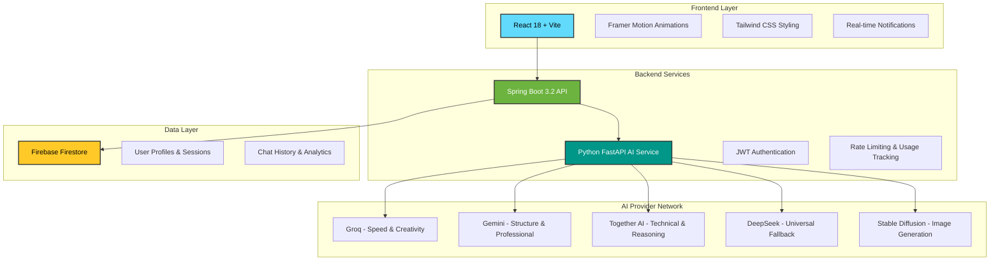

# 🚀 Creo - AI Content Generation Platform

> **A sophisticated, enterprise-grade AI content generation platform with intelligent multi-provider routing, real-time streaming, image generation, and professional-grade export capabilities.**

<div align="center">


[](https://opensource.org/licenses/MIT)
[](http://makeapullrequest.com)

[Features](#-features) • [Architecture](#-architecture) • [Quick Start](#-quick-start) • [Documentation](#-documentation) • [API Reference](#-api-reference)

</div>

---

## 📋 Table of Contents

- [Overview](#-overview)
- [Features](#-features)
- [Architecture](#-architecture)
- [Technology Stack](#-technology-stack)
- [Prerequisites](#-prerequisites)
- [Quick Start](#-quick-start)
- [Project Structure](#-project-structure)
- [Configuration](#-configuration)
- [API Reference](#-api-reference)
- [Usage Examples](#-usage-examples)
- [Development](#-development)
- [Deployment](#-deployment)
- [Contributing](#-contributing)
- [License](#-license)

---

## 🌟 Overview

**Creo** is a production-ready AI content generation platform that combines the power of multiple AI providers (Groq, Gemini, Together AI, DeepSeek) with intelligent routing, real-time streaming, and professional export capabilities. Built with modern technologies and best practices, it offers a seamless experience for generating 12+ types of professional content.

### 🎯 Key Highlights

- **🧠 Intelligent AI Routing**: Content-aware provider selection with automatic fallback
- **⚡ Real-Time Streaming**: Word-by-word generation using Server-Sent Events (SSE)
- **🎨 Image Generation**: Stable Diffusion integration for AI-powered images
- **📄 Professional Exports**: PDF, HTML, Markdown with ATS-optimized templates
- **🔒 Enterprise Security**: JWT authentication, rate limiting, Firebase integration
- **🌍 Multi-Language**: Support for 11 languages including English, Hindi, Spanish, Japanese
- **💬 Smart Follow-ups**: Context-aware question suggestions for each content type
- **📊 Usage Analytics**: Real-time tracking with daily reset countdown

---

## ✨ Features

### 🎨 Content Generation (12 Types)

| Content Type | AI Provider | Optimized For |
|-------------|-------------|---------------|
| **Blog Posts** | Gemini | SEO-optimized, structured content |
| **Resumes** | Together AI | ATS-friendly, technical accuracy |
| **Cover Letters** | Gemini | Professional tone, persuasive |
| **Social Media** | Groq | Creative, engaging, viral |
| **Emails** | Gemini | Professional, clear communication |
| **Ad Copy** | Groq | Persuasive, conversion-focused |
| **Tweet Threads** | Groq | Engaging, shareable |
| **YouTube Scripts** | Groq | Entertaining, structured |
| **Product Descriptions** | Groq | Compelling, benefit-driven |
| **Essays** | Gemini | Academic, well-researched |
| **Code Explanations** | Together AI | Technical precision, clarity |
| **General Content** | DeepSeek | Versatile, balanced |

### 🎛️ Advanced Customization

**7 Tone Options:**
- Professional • Casual • Formal • Persuasive • Friendly • Witty • Empathetic

**4 Length Settings:**
- Short (100-300 words) • Medium (300-800 words) • Long (800+ words) • Auto-optimized

**11 Languages:**
- English • Hindi • Telugu • Spanish • French • German • Portuguese • Arabic • Japanese • Chinese (Simplified) • Korean

### 🖼️ Image Generation

- **Stable Diffusion** integration for AI-powered image creation
- Multiple style presets and customization options
- Secure image storage and retrieval
- Rate limiting (10 images/day for free tier)

### 📤 Export Capabilities

- **PDF Export**: ATS-optimized for resumes/cover letters with professional styling
- **HTML Export**: Responsive, styled, copy-ready
- **Markdown Export**: Clean formatting, developer-friendly
- **Plain Text**: No formatting, social media ready

### 🔐 Security & Authentication

- JWT-based authentication (access + refresh tokens)
- BCrypt password hashing
- Firebase Firestore integration
- Rate limiting (10 messages/day free tier)
- CORS protection
- Input validation and sanitization

### 💬 Chat Features

- Real-time streaming responses
- Session management with date-based grouping
- Chat history persistence
- Context-aware follow-up questions
- Message regeneration with variety
- Conversation export

---

## 🏗️ Architecture



### System Flow

1. **User Request** → Frontend (React)
2. **Authentication** → Backend (Spring Boot) validates JWT
3. **Rate Limiting** → Backend checks daily usage limits
4. **AI Routing** → AI Service (FastAPI) selects optimal provider
5. **Content Generation** → AI Provider generates content
6. **Streaming Response** → SSE streams back to frontend
7. **Data Persistence** → Firebase Firestore stores chat history

---

## 🛠️ Technology Stack

### Frontend
- **React 18.2** - Modern UI library with hooks
- **Vite** - Lightning-fast build tool
- **Framer Motion** - Smooth animations
- **Tailwind CSS** - Utility-first styling
- **Axios** - HTTP client
- **React Router** - Client-side routing
- **React Hot Toast** - Notifications
- **React Markdown** - Markdown rendering
- **Lucide React** - Icon library

### Backend
- **Spring Boot 3.2** - Enterprise Java framework
- **Java 17** - LTS version
- **Spring Security** - Authentication & authorization
- **Firebase Admin SDK** - Firestore integration
- **JJWT** - JWT token handling
- **WebFlux** - Reactive programming
- **Maven** - Dependency management
- **Lombok** - Boilerplate reduction

### AI Service
- **FastAPI** - Modern Python web framework
- **Python 3.10+** - Programming language
- **Pydantic** - Data validation
- **Uvicorn** - ASGI server
- **Groq SDK** - Groq API integration
- **Google Generative AI** - Gemini integration
- **Together AI SDK** - Together API integration
- **OpenAI SDK** - DeepSeek integration
- **Replicate** - Stable Diffusion integration
- **WeasyPrint** - PDF generation
- **Markdown** - Text processing

### Database & Storage
- **Firebase Firestore** - NoSQL cloud database
- **Local File Storage** - Generated images

---

## 📦 Prerequisites

Before you begin, ensure you have the following installed:

- **Node.js** 18+ and npm
- **Java** 17+ (OpenJDK recommended)
- **Maven** 3.6+
- **Python** 3.10+
- **Git** (for cloning the repository)

### Required API Keys (All have free tiers)

1. **Firebase Account** - [Get Started](https://firebase.google.com/)
2. **Groq API Key** - [Get Key](https://console.groq.com/)
3. **Google Gemini API Key** - [Get Key](https://makersuite.google.com/app/apikey)
4. **Together AI API Key** - [Get Key](https://api.together.xyz/)
5. **DeepSeek API Key** - [Get Key](https://platform.deepseek.com/)
6. **Replicate API Token** (Optional for images) - [Get Token](https://replicate.com/)

---

## 🚀 Quick Start

### Option 1: Automated Setup (Recommended)

**Linux/Mac:**
```bash
# Clone the repository
git clone https://github.com/yourusername/creo-ai-platform.git
cd creo-ai-platform

# Run automated setup
chmod +x setup.sh
./setup.sh
```

**Windows:**
```bash
# Clone the repository
git clone https://github.com/yourusername/creo-ai-platform.git
cd creo-ai-platform

# Run automated setup
setup.bat
```

The setup script will:
- Create `.env` files with templates
- Install all dependencies
- Verify installations
- Provide next steps

### Option 2: Manual Setup

#### 1. Clone the Repository
```bash
git clone https://github.com/yourusername/creo-ai-platform.git
cd creo-ai-platform
```

#### 2. Setup AI Service
```bash
cd ai-service

# Create virtual environment
python -m venv venv

# Activate virtual environment
# Linux/Mac:
source venv/bin/activate
# Windows:
venv\Scripts\activate

# Install dependencies
pip install -r requirements.txt

# Create .env file
cp .env.example .env
# Edit .env and add your API keys
```

#### 3. Setup Backend
```bash
cd backend

# Create application.properties
cp src/main/resources/application.properties.example src/main/resources/application.properties
# Edit application.properties and configure Firebase

# Add Firebase credentials
# Place your firebase-credentials.json in backend/src/main/resources/

# Install dependencies (Maven will handle this)
./mvnw clean install
```

#### 4. Setup Frontend
```bash
cd frontend

# Install dependencies
npm install

# Create .env file
cp .env.example .env
# Edit .env if needed (defaults should work for local development)
```

---

## 🎮 Running the Application

You need **3 terminal windows** to run all services:

### Terminal 1: AI Service
```bash
cd ai-service
source venv/bin/activate  # Windows: venv\Scripts\activate
python main.py
```
✅ Runs on: `http://localhost:8000`

### Terminal 2: Backend
```bash
cd backend
./mvnw spring-boot:run
```
✅ Runs on: `http://localhost:8080`

### Terminal 3: Frontend
```bash
cd frontend
npm run dev
```
✅ Runs on: `http://localhost:5173`

### Access the Application

- **Application**: http://localhost:5173
- **API Documentation**: http://localhost:8000/docs (Swagger UI)
- **Backend Health**: http://localhost:8080/actuator/health

---

## 📁 Project Structure

```
creo-ai-platform/
│
├── frontend/                      # React 18 + Vite Frontend
│   ├── src/
│   │   ├── components/
│   │   │   ├── chat/             # Chat UI components
│   │   │   │   ├── ChatInterface.jsx
│   │   │   │   ├── MessageList.jsx
│   │   │   │   ├── Sidebar.jsx
│   │   │   │   └── FollowUpQuestions.jsx
│   │   │   ├── ui/               # Reusable UI components
│   │   │   └── layout/           # Layout components
│   │   ├── context/              # React Context
│   │   │   ├── AuthContext.jsx
│   │   │   ├── ChatContext.jsx
│   │   │   └── NotificationContext.jsx
│   │   ├── pages/                # Main pages
│   │   │   ├── ChatPage.jsx
│   │   │   ├── LoginPage.jsx
│   │   │   ├── RegisterPage.jsx
│   │   │   └── ProfilePage.jsx
│   │   ├── services/             # API integration
│   │   │   ├── api.js
│   │   │   ├── authService.js
│   │   │   └── chatService.js
│   │   ├── utils/                # Utility functions
│   │   ├── App.jsx               # Main app component
│   │   └── main.jsx              # Entry point
│   ├── public/                   # Static assets
│   ├── package.json
│   └── vite.config.js
│
├── backend/                       # Spring Boot 3.2 Backend
│   ├── src/main/java/com/contentgen/
│   │   ├── controllers/          # REST endpoints
│   │   │   ├── AuthController.java
│   │   │   ├── ChatController.java
│   │   │   ├── UserController.java
│   │   │   └── ImageController.java
│   │   ├── services/             # Business logic
│   │   │   ├── AuthService.java
│   │   │   ├── ChatService.java
│   │   │   ├── UserService.java
│   │   │   └── AIService.java
│   │   ├── models/               # Data entities
│   │   │   ├── User.java
│   │   │   ├── ChatSession.java
│   │   │   └── ChatMessage.java
│   │   ├── dto/                  # Data transfer objects
│   │   ├── config/               # Configuration
│   │   │   ├── SecurityConfig.java
│   │   │   ├── FirebaseConfig.java
│   │   │   └── WebClientConfig.java
│   │   ├── security/             # Security components
│   │   │   ├── JwtFilter.java
│   │   │   └── JwtUtil.java
│   │   └── ContentGeneratorApplication.java
│   ├── src/main/resources/
│   │   ├── application.properties
│   │   └── firebase-credentials.json
│   ├── pom.xml
│   └── run.sh / run.bat
│
├── ai-service/                    # FastAPI AI Service
│   ├── routers/                  # API endpoints
│   │   ├── chat.py               # Chat endpoints
│   │   ├── generate.py           # Content generation
│   │   ├── tools.py              # Export tools
│   │   ├── followup.py           # Follow-up questions
│   │   └── image.py              # Image generation
│   ├── services/                 # Core logic
│   │   ├── ai_client.py          # AI provider clients
│   │   ├── ai_providers.py       # Provider configurations
│   │   ├── model_router.py       # Intelligent routing
│   │   ├── streaming.py          # SSE streaming
│   │   ├── export_service.py     # Export functionality
│   │   ├── pdf_exporter.py       # PDF generation
│   │   ├── image_service.py      # Image generation
│   │   └── followup_service.py   # Follow-up logic
│   ├── prompts/                  # Prompt templates
│   │   ├── templates.py          # Content templates
│   │   ├── tone_modifiers.py     # Tone variations
│   │   └── resume_template.py    # Resume prompts
│   ├── models/                   # Pydantic schemas
│   │   └── schemas.py
│   ├── utils/                    # Utility functions
│   ├── tests/                    # Test suite
│   ├── generated_images/         # Image storage
│   ├── main.py                   # FastAPI app
│   ├── requirements.txt
│   └── README.md
│
├── docs/                          # Documentation
│   ├── API_DOCUMENTATION.md
│   ├── SETUP_GUIDE.md
│   ├── MIGRATION_GUIDE.md
│   └── TESTING_GUIDE.md
│
├── .gitignore
├── README.md
└── LICENSE
```

---

## ⚙️ Configuration

### AI Service Configuration (`.env`)

```env
# AI Provider API Keys
GROQ_API_KEY=your_groq_api_key_here
GEMINI_API_KEY=your_gemini_api_key_here
TOGETHER_API_KEY=your_together_api_key_here
DEEPSEEK_API_KEY=your_deepseek_api_key_here
REPLICATE_API_TOKEN=your_replicate_token_here  # Optional for images

# Service Configuration
SERVICE_PORT=8000
LOG_LEVEL=INFO
```

### Backend Configuration (`application.properties`)

```properties
# Server Configuration
server.port=8080
spring.application.name=ai-content-generator

# Firebase Configuration
firebase.credentials.path=firebase-credentials.json

# JWT Configuration
jwt.secret=your-super-secret-jwt-key-change-this-in-production
jwt.expiration=900000
jwt.refresh.expiration=604800000

# AI Service Configuration
ai.service.url=http://localhost:8000

# Rate Limiting
rate.limit.enabled=true
rate.limit.daily.messages=10
rate.limit.daily.images=10

# CORS Configuration
cors.allowed.origins=http://localhost:5173,http://localhost:3000
```

### Frontend Configuration (`.env`)

```env
VITE_API_BASE_URL=http://localhost:8080/api
VITE_AI_SERVICE_URL=http://localhost:8000
```

### Firebase Setup

1. Create a Firebase project at [Firebase Console](https://console.firebase.google.com/)
2. Enable Firestore Database
3. Create a service account and download credentials
4. Save as `backend/src/main/resources/firebase-credentials.json`
5. Update Firestore security rules:

```javascript
rules_version = '2';
service cloud.firestore {
  match /databases/{database}/documents {
    match /users/{userId} {
      allow read, write: if request.auth != null && request.auth.uid == userId;
    }
    match /chatSessions/{sessionId} {
      allow read, write: if request.auth != null;
    }
    match /chatMessages/{messageId} {
      allow read, write: if request.auth != null;
    }
  }
}
```

---

## 📚 API Reference

### Authentication Endpoints

#### Register User
```http
POST /api/auth/register
Content-Type: application/json

{
  "email": "user@example.com",
  "username": "username",
  "password": "password123",
  "fullName": "John Doe"
}
```

#### Login
```http
POST /api/auth/login
Content-Type: application/json

{
  "email": "user@example.com",
  "password": "password123"
}
```

**Response:**
```json
{
  "accessToken": "eyJhbGciOiJIUzI1NiIs...",
  "refreshToken": "eyJhbGciOiJIUzI1NiIs...",
  "user": {
    "id": "user123",
    "email": "user@example.com",
    "username": "username",
    "fullName": "John Doe"
  }
}
```

### Chat Endpoints

#### Stream Chat Response
```http
POST /api/chat/message/stream
Authorization: Bearer {accessToken}
Content-Type: application/json

{
  "sessionId": "session123",
  "content": "Write a professional email",
  "contentType": "email",
  "tone": "professional",
  "length": "medium",
  "language": "English"
}
```

**Response:** Server-Sent Events (SSE) stream

#### Get Chat Sessions
```http
GET /api/chat/sessions
Authorization: Bearer {accessToken}
```

### AI Service Endpoints

#### Generate Content
```http
POST /chat/stream
Content-Type: application/json

{
  "prompt": "Write a blog post about AI",
  "content_type": "blog_post",
  "tone": "professional",
  "length": "medium",
  "language": "English",
  "user_id": "user123"
}
```

#### Generate Image
```http
POST /image/generate
Content-Type: application/json

{
  "prompt": "A futuristic city at sunset",
  "user_id": "user123"
}
```

#### Export to PDF
```http
POST /tools/export-pdf
Content-Type: application/json

{
  "content": "# Resume\n\n## Experience...",
  "content_type": "resume"
}
```

**Full API documentation available at:**
- Backend: `backend/API_DOCUMENTATION.md`
- AI Service: `ai-service/API_DOCUMENTATION.md`
- Interactive Swagger UI: http://localhost:8000/docs

---

## 💡 Usage Examples

### Example 1: Generate a Blog Post

```javascript
// Frontend code
const response = await chatService.sendStreamingMessage({
  sessionId: currentSessionId,
  content: "Write a blog post about the future of AI in healthcare",
  contentType: "blog_post",
  tone: "professional",
  length: "long",
  language: "English"
});
```

### Example 2: Generate an ATS-Optimized Resume

```javascript
const response = await chatService.sendStreamingMessage({
  sessionId: currentSessionId,
  content: "Create a resume for a senior software engineer with 5 years experience in React and Node.js",
  contentType: "resume",
  tone: "professional",
  length: "medium",
  language: "English"
});

// Export to PDF
const pdfBlob = await exportService.exportToPDF(response.content, "resume");
```

### Example 3: Generate Social Media Content

```javascript
const response = await chatService.sendStreamingMessage({
  sessionId: currentSessionId,
  content: "Create an engaging Instagram post about sustainable fashion",
  contentType: "social_media",
  tone: "friendly",
  length: "short",
  language: "English"
});
```

### Example 4: Generate AI Images

```javascript
const imageResponse = await imageService.generateImage({
  prompt: "A serene mountain landscape at golden hour",
  userId: currentUser.id
});

console.log(imageResponse.image_url); // URL to generated image
```

---

## 🔧 Development

### Running Tests

**AI Service Tests:**
```bash
cd ai-service
source venv/bin/activate
python -m pytest tests/
```

**Backend Tests:**
```bash
cd backend
./mvnw test
```

**Frontend Tests:**
```bash
cd frontend
npm run test
```

### Code Quality

**Linting:**
```bash
# Frontend
cd frontend
npm run lint

# Backend (using Checkstyle)
cd backend
./mvnw checkstyle:check
```

### Building for Production

**Frontend:**
```bash
cd frontend
npm run build
# Output in frontend/dist/
```

**Backend:**
```bash
cd backend
./mvnw clean package
# Output in backend/target/ai-content-generator-1.0.0.jar
```

**AI Service:**
```bash
cd ai-service
pip install -r requirements.txt
# Run with production settings
uvicorn main:app --host 0.0.0.0 --port 8000 --workers 4
```

---

## 🚢 Deployment

### Docker Deployment (Recommended)

**Build Docker images:**
```bash
# Frontend
docker build -t creo-frontend ./frontend

# Backend
docker build -t creo-backend ./backend

# AI Service
docker build -t creo-ai-service ./ai-service
```

**Run with Docker Compose:**
```bash
docker-compose up -d
```

### Cloud Deployment Options

**Frontend:**
- Vercel (Recommended)
- Netlify
- AWS Amplify
- Firebase Hosting

**Backend:**
- AWS Elastic Beanstalk
- Google Cloud Run
- Heroku
- DigitalOcean App Platform

**AI Service:**
- AWS Lambda (with API Gateway)
- Google Cloud Functions
- Railway
- Render

### Environment Variables for Production

Ensure all sensitive data is stored in environment variables:
- Never commit API keys or credentials
- Use secrets management (AWS Secrets Manager, Google Secret Manager)
- Enable HTTPS/TLS for all endpoints
- Configure proper CORS origins
- Set up monitoring and logging

---

## 🤝 Contributing

We welcome contributions! Please follow these steps:

1. **Fork the repository**
2. **Create a feature branch**
   ```bash
   git checkout -b feature/amazing-feature
   ```
3. **Commit your changes**
   ```bash
   git commit -m 'Add some amazing feature'
   ```
4. **Push to the branch**
   ```bash
   git push origin feature/amazing-feature
   ```
5. **Open a Pull Request**

### Contribution Guidelines

- Follow existing code style and conventions
- Write clear commit messages
- Add tests for new features
- Update documentation as needed
- Ensure all tests pass before submitting PR

---

## 📄 License

This project is licensed under the MIT License - see the [LICENSE](LICENSE) file for details.

---

## 🙏 Acknowledgments

- **Groq** - Ultra-fast AI inference
- **Google Gemini** - Advanced language understanding
- **Together AI** - Open-source model hosting
- **DeepSeek** - Reliable AI provider
- **Replicate** - Stable Diffusion hosting
- **Firebase** - Backend infrastructure
- **Spring Boot** - Enterprise Java framework
- **FastAPI** - Modern Python web framework
- **React** - UI library

---

## 📞 Support

- **Documentation**: Check the `/docs` folder
- **Issues**: [GitHub Issues](https://github.com/yourusername/creo-ai-platform/issues)
- **Discussions**: [GitHub Discussions](https://github.com/yourusername/creo-ai-platform/discussions)
- **Email**: support@creo-ai.com

---

## 🗺️ Roadmap

- [ ] Premium subscription plans
- [ ] Team collaboration features
- [ ] Advanced analytics dashboard
- [ ] Mobile app (React Native)
- [ ] Voice input support
- [ ] Multi-modal content generation
- [ ] Custom AI model fine-tuning
- [ ] API access for developers
- [ ] WordPress/CMS integrations
- [ ] Browser extensions

---

<div align="center">

**Built with ❤️ by the Creo Team**

⭐ Star us on GitHub if you find this project useful!

[Website](https://creo-ai.com) • [Documentation](./docs) • [API Reference](./ai-service/API_DOCUMENTATION.md) • [Contributing](./CONTRIBUTING.md)

</div>
